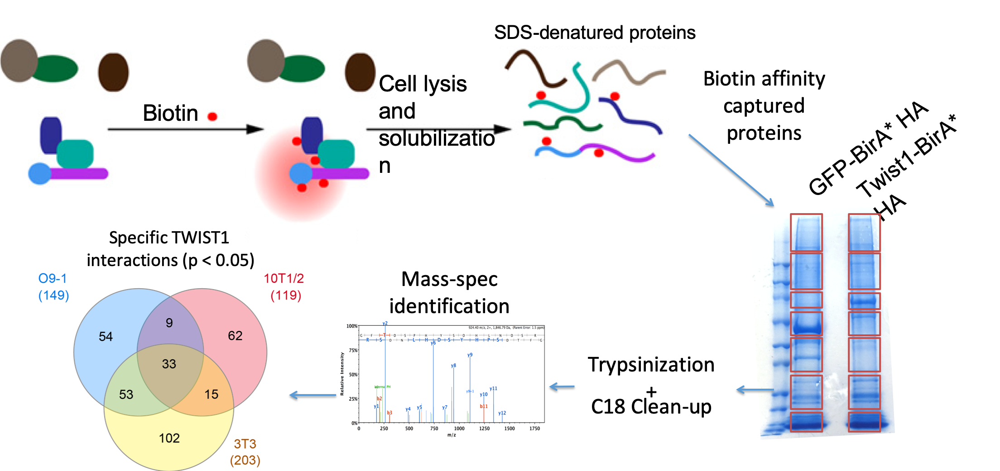
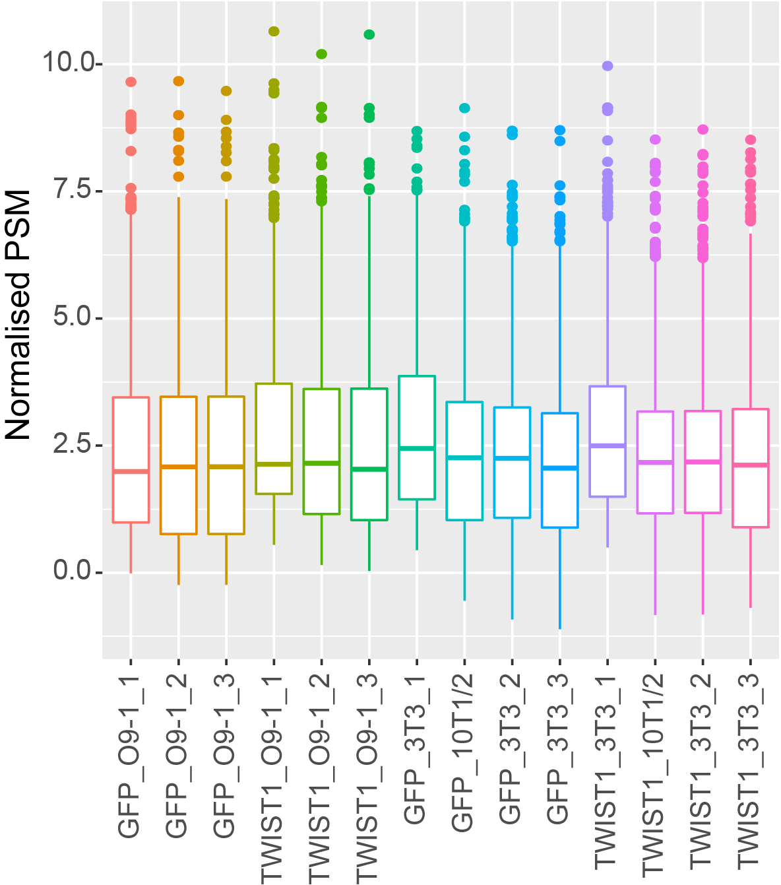
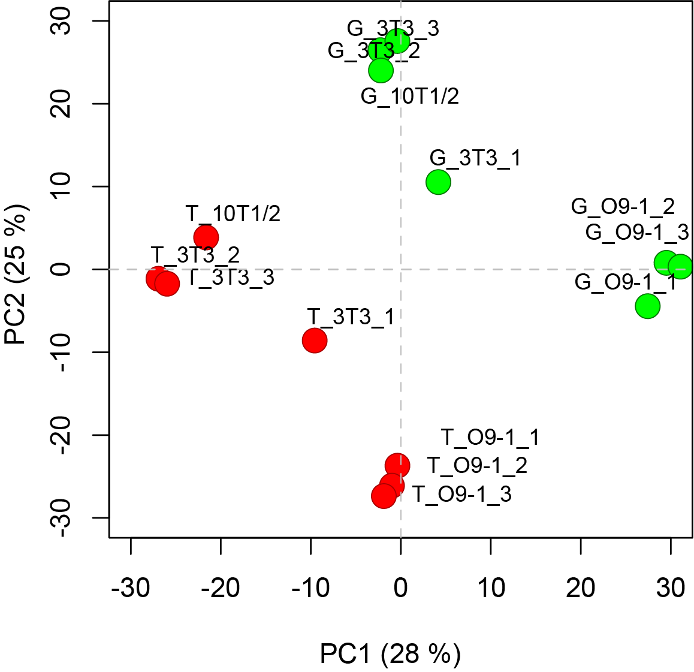
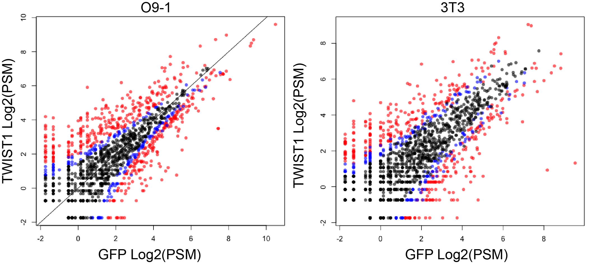
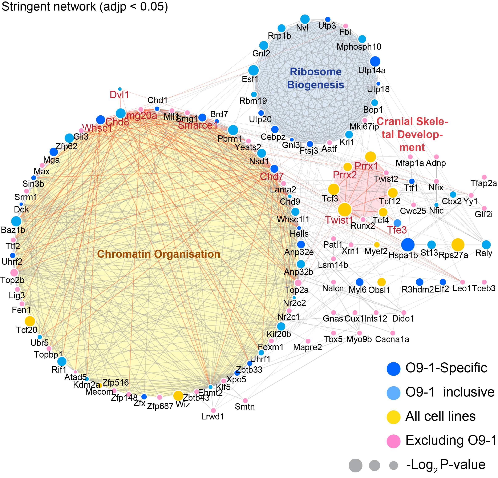
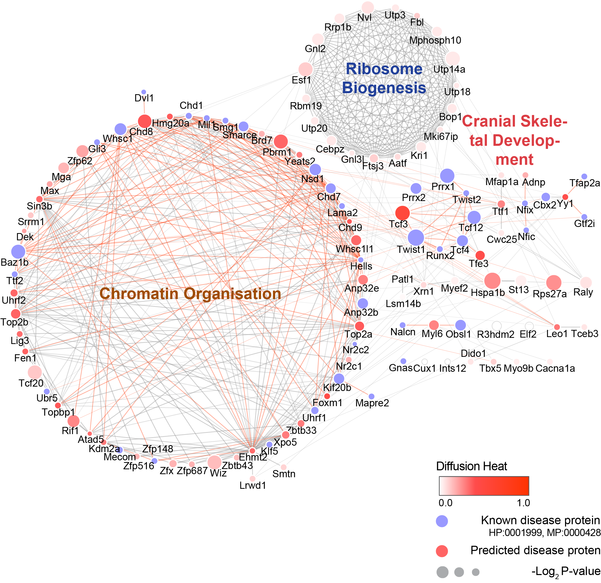
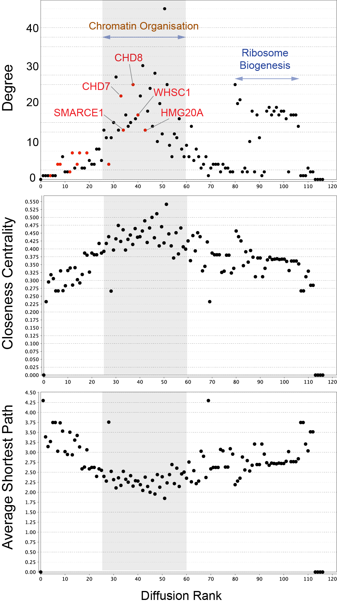

# BioID network propagation identified TWIST1-CHD8 module in cranial neural crest specification and ectomesenchymal potential

## Table of Contents

- [Project title](#BioID-network-propagation-identified-TWIST1-CHD8-module)
  - [Table of Contents](#table-of-contents)
  - [Introduction](#introduction)
  - [Results](#results)
    - [Proteomic data analysis and visualization](#proteomic-data-analysis-and-visualization)
    - [ChIP-seq data analysis](#chIP-seq-data-analysis)
    - [Cell migration assays](#cell-migration-assays)

## Introduction

Using BioID-proximity-labelling approach and network propagation analysis, we identified a chromatin regulatory module in the functional network of TWIST1, a key molecular nexus in cranial neural crest cell (NCC) development. Genomic occupancy and transcriptome data of chromatin regulatory module members CHD7, CHD8 and WHSC1 suggested that they share roles in activating NCC-related neurogenic and cell migratory programs. Compound heterozygous loss of function mutants further revealed their dynamic expression and stage-specific functional cooperativity for NCC specification: In early ectoderm differentiation, the TWIST1-chromatin modifier module potentiates NCC fate in bipotent neural progenitors while repels SOX2-driven cortical neural stem cell fate. Later, TWIST1-CHD8 interaction maintains the ectomesenchymal potential in NC stem cells. Combined mutations of Twist1 and Chd8 in mouse embryos also led to malformation of craniofacial tissues. Altogether, our results have suggested a role of TWIST1 in pioneering the assembly of an epigenetic complex responsible in establishing the promoter/enhancer repertoires for NCC fate progression and ectomesenchymal potential. Our findings also suggests a common mechanism underlying the neural crest-related pathologies associated with TWIST1, CHD7, CHD8 and WHSC1.

## Methods

### Proteomic data analysis and visualization
#### Experimental Overview

The comprehensive protein interactome of TWIST1 was characterised using the BioID technique (Roux et al., 2012) in three mouse cell types: the cranial neural crest stem cell line (O9-1) (Ishii et al., 2012), the C3H10T1/2 multipotent mesenchymal cell line (Katagiri et al., 1990; Shea et al., 2003) and the 3T3 fibroblast cell line. 

#### Computational analysis Overview

 * [BioID analysis by EdgeR](https://github.com/ifanirene1/BioID/blob/master/Merged_bioID_Reanalysis.R) 
    
 * __Pre-processing of raw mass spectrometry data__
    
    Raw MS data files were processed using Proteome Discoverer v.1.3 (Thermo Fisher Scientific). Processed files were searched against the UniProt mouse database (downloaded Nov 2016) using the Mascot search engine version 2.3.0. Searches were done with tryptic specificity allowing up to two missed cleavages and a tolerance on mass measurement of 10 ppm in MS mode and 0.3 Da for MS/MS ions. Variable modifications allowed were acetyl (Protein N-terminus), oxidized methionine, glutamine to pyro-glutamic acid and deamidation of asparagine and glutamine residues. Carbamidomethyl of cysteines was a fixed modification. Using a reversed decoy database, a false discovery rate (FDR) threshold of 1% was used. The lists of protein groups were filtered for first hits.
    
    Processing and analysis using raw peptide-spectrum match (PSM) values were performed following the protocol by Waardenberg (Waardenberg, 2017). Data were normalised by total peptide library size (Figure S2B), based on the assumption that the same amount of starting materials was loaded onto the mass spectrometer for the test and control samples. A PSM value of 0 was assigned to missing values for peptide absent from the sample or below detection level (Sharma et al., 2009). Data points filtered by the quality criterion that peptides had to be present in at least two replicate experiments with a PSM value above 2. The normalised and filtered data matrix was subjected to negative binomial tests, using the EdgeR package (Robinson et al., 2010). Three biological experiment sets for O9-1 and 3T3 each, and one replicate for C3H10T1/2 cell line was analysed, use dispersion estimated from the whole dataset. Stringent TWIST1-specific interactions in the three cell lines were determined based on the multi-test adjusted p-values (adjp < 0.05 and fold-change > 3).
    
    
    __`PSM count normalization`__: Mean peptide spectrum match (PSM) across samples, normalised by total PSM of the peptide library.
    
    
    __`PCA plot of normalised PSM data`__: Green dots, GFP-birA* (G) groups; Red dots, TWIST1-BirA*(T) groups.
    
    
    __`EdgeR test result`__: Visualisation of quantity correlation between GFP- and TWIST1-BirA labelled proteins, and negative binomial test result for 3T3 and O9-1 cells. Each data point represents one protein, plotted with their log2 transformed PSM values in TWIST1-BirA or GFP group. Negative binomial statistical tests were performed with the EdgeR package: red, adjp < 0.05 (significant), blue, adjp = 0.05, black, adjp > 0.05.

    
    __`Stringent TWIST1 network`__: Network constructed from stringent TWIST1-specific interactions (adjp < 0.05) with non-specific and unconnected nodes observed in panel B removed. Three clusters were labelled with representative GO term. Node colour = cell source; Node size = -Log(adjp). 
    
* __Network propagation for functional identification and novel disease gene annotation__
    
    Prior knowledge of mouse protein functional associations, weighted based on known protein-protein interaction (PPI), co-expression, evolutionary conservation and test mining results, were retrieved by the Search Tool for the Retrieval of Interacting Genes (STRING) (Szklarczyk et al., 2015). An intermediate confidence (combined score) of > 0.4 was used as the cut-off for interactions. The inferred network was imported into Cytoscape for visualization (Shannon et al., 2003). We used MCL algorism (Enright et al., 2002), which emulates random walks between TWIST1 interacting proteins to detect clusters in the network, using STRING association matrix as the probability flow matrix. Gene ontology and transcriptional binding site enrichment analysis for proteins were obtained from the ToppGene database (Chen et al., 2009), with false-discovery rate < 0.05. The enriched functional term of known nodes was used to annotate network neighbours within the cluster with unclear roles. 
    
    Heat diffusion was performed on the network, using twenty-two genes associated with human facial malformation (HP:0001999) as seeds. Diffusion score of 1 was assigned to the seeds and these scores were allowed to propagate to network neighbours, and heat stored in nodes after set time = 0.25 was calculated (Table S2). NetworkAnalyser (Assenov et al., 2008), which is a feature of Cytoscape, was used to calculate nodes Degree (number of edges), Average Shortest Path (connecting nodes), and Closeness Centrality (a measure of how fast information spreads to other nodes).
    
    
    __`Heat-diffusion of craniofacial disease factors`__: Craniofacial disease heat diffusion coloured score (red shades) superimposed on TWIST1 interactome scaffold from __`Stringent TWIST1 network`__. Genes associated with human and mouse facial malformation (HP:0001999, MP:0000428) were used as seeds (purple) for heat diffusion through network neighbours. Node size reflects probability of interaction with TWIST1 in O9-1 NCCs. Red strings highlight direct connection of the known disease nodes.
    
    
    __`Network analysis`__: Plots generated by NetworkAnalyser (Assenov et al., 2008) for Diffusion Rank of nodes against their i. Degree of connection (number of edges), ii. Closeness centrality, a measures of how fast information spreads to other nodes, and iii. Average Shortest Path to connect to other nodes. Cluster where peaks of highly connected nodes were labelled in i. Putative craniofacial disease factor is likely to arise in the shaded region.

### ChIP-seq data analysis

* [ChIP-seq analysis pipeline](https://github.com/ifanirene1/BioID/blob/master/Grimes_ChIP-seq_IF.sh) 

ChIP-seq quality control results and analysis can be found in Figure S3. Adaptors from raw sequencing data were removed using Trimmomatic (Bolger et al., 2014) and aligned to the mm10 mouse genome (GENCODE GRCm38.p5; (Frankish et al., 2019) using BWA aligner (Li and Durbin, 2009) and duplicates/unpaired sequences were removed using the picardtools (http://broadinstitute.github.io/picard/). MACS2 package (Zhang et al., 2008) was used for ChIP-seq peak calling for both Twist1-/-; Flag-Twist1 O/E and Twist1-/- IP samples against genomic input. IDR analysis was performed using the P-value as the ranking measure, with an IDR cut-off of 0.05. Peak coordinates from the two replicates were merged, using the most extreme start and end positions.

### Fluidigm high-througput qPCR analysis

* [high-througput qPCR analysis code](https://github.com/ifanirene1/BioID/blob/master/Biomark_TWIST_NPC_IF.R) 

* Raw data was extracted using the Fluidigm Real-Time PCR Analysis Software and subsequent analysis was performed in R-studio. Ct values flagged as undetermined or greater than the threshold (Ct > 24) were assigned as missing values. Samples with a measurement for only one housekeeping gene or samples with measurements for < 30 genes were excluded from further analysis. Genes where > 30 samples had a measurement of NA were also excluded from further analysis. Data were normalized using expressions of average of 3 housekeeping genes (Gapdh, Tbp, Actb). Regularized-log transformation of the count matrix was then performed, and PCA loading gene was generated using functions in DEseq2 package. Differential gene expression analysis was performed using one-way ANOVA. 

### Cell migration assays

#### Experimental overview

* __Scratch Assay and quantification__

    Scratch Assays were performed on O9-1 cells following transient siRNA lipofectamine transfections. O9-1 cells were seeded at a density of 0.5x105 cells per well on Matrigel coated 24-well plate on the day of transfection.

    20 pmol of siRNA for candidate gene (Chd7, Chd8 or Whsc1) and 20 pmol siRNA for Twist1 or control was applied per well (24-well-plate), plus 3 μL lipofectamine RNAiMAX reagent (Thermo Fisher Scientific, cat. #13778075), following manufacturer protocol. Knockdown efficiency was assessed by qRT-PCR (Table S7).

    48 hours after transfection, a scratch was made in each well on the confluent cell monolayer. Live cell images were taken with Cell Observer Widefield microscope (ZEISS international) under normal cell culture conditions (37°C, 5% CO2). Bright-field images were captured at set tile regions every 15 mins over a 10 hours’ period. Total migration area from start of imaging until the time point when the first cell line closed gap was quantified by ImageJ.

#### Computational analysis
    
* [Time-lapse imaging analysis in ImageJ: NPC](https://github.com/ifanirene1/BioID/blob/master/NPC_migration_ImageJ_analysis.ijm) 
* [Time-lapse imaging analysis in ImageJ: MSC Scratch Assay](https://github.com/ifanirene1/BioID/blob/master/ScratchAssay_sensitive_ImageJ_analysis.ijm) 